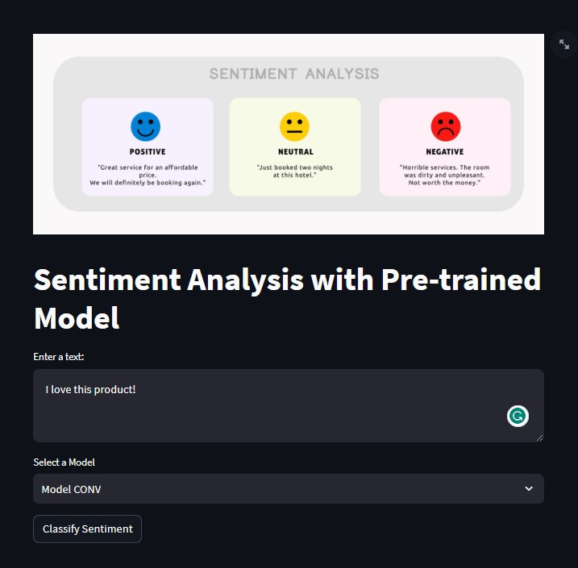
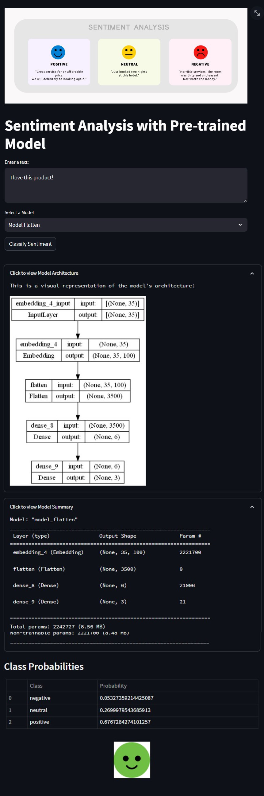

## Text Sentiment Classification With Deep Learning Models

    

<p align="center">
  
</p>


## Table of Contents

1. [Introduction](#introduction)

    1.1 [Project Description](#description)

    1.2 [Project Motivation](#motivation)
2. [Project Overview](#project-overview)

    2.1 [Overview of the Dataset](#dataset-overview)

    2.2 [Dataset Problem Statement](#problem-statement)
3. [Features](#features)
4. [Project Directory Structure](#directory-structure)
5. [Steps](#steps)

    5.1 [Data Collection and Preprocessing](#data-collection-and-preprocessing)

    5.2 [Model Training](#model-training)

    5.3 [Displaying Model Summary and Architecture](#model-summary-and-architecture)

    5.4 [Plotting Training and Validation Metrics](#plotting-training-and-validation-metrics)

    5.5 [Saving Best Model](#saving-best-model)

    5.6 [Creating Streamlit App Layout](#creating-streamlit-app-layout)

    5.7 [Running the App](#running-the-app)

   5.8 [Interact with the App](#interact-with-the-app)
6. [Requirements](#requirements)
7. [Usage](#usage)
8. [Screenshots](#screenshots)
9. [Notebook Structure](#notebook-structure)

     9.1 [Running the Notebook](#running-the-notebook)

      9.2 [Results and Visualizations](#results-and-visualizations)
10. [License](#license)
11. [Acknowledgements](#acknowledgements)
12. [Contact Information](#contact-information)

## Introduction <a name="introduction"></a>

### Project Description <a name="description"></a>

Sentiment analysis is the process of determining the sentiment (positive, negative, neutral) expressed in a piece of text. This project utilizes various deep learning models and pre-trained word embeddings (GloVe) to perform sentiment analysis on textual data. The primary goal is to classify text into one of three categories: positive, negative, or neutral sentiment.

### Project Motivation <a name="motivation"></a>

Sentiment analysis is a fundamental task in natural language processing that has various real-world applications. Understanding the sentiment expressed in text data can provide valuable insights into user opinions, emotions, and trends. This project was motivated by the desire to explore sentiment analysis techniques and showcase their implementation through an interactive web application.

The goals of this project include:

- **Exploring Deep Learning:** Our primary objective is to delve into the domain of deep learning, with a specific focus on recurrent neural networks (RNNs). These RNNs demonstrate remarkable proficiency in comprehending textual data. Additionally, we are actively engaged in experimenting with diverse approaches to determine the most effective one.
- **Enhancing Text Understanding:** In our endeavor to enhance the intelligence of our models, we are incorporating advanced word techniques. Notably, we are leveraging GloVe, a technique that significantly amplifies our models' capacity to comprehend the semantic nuances of words.
- **User-Friendly App:** We're packaging all these advanced models into a user-friendly application using Streamlit. This means anyone can use it to get insights from their text.

By sharing this project, we aim to contribute to the knowledge and understanding of sentiment analysis while providing a hands-on example for those interested in exploring natural language processing and interactive web application development.

## Project Overview <a name="project-overview"></a>

### Overview of the Dataset <a name="dataset-overview"></a>

The dataset used for this project is the "Tweet Sentiment Extraction" dataset from Kaggle. This dataset contains tweets along with their associated sentiment labels and selected text. The selected text provides a concise representation of the tweet's sentiment. The dataset is utilized to train sentiment analysis models for predicting the sentiment of tweets.

#### Columns

- `textID`: A unique ID for each piece of text.
- `text`: The text of the tweet.
- `sentiment`: The general sentiment label of the tweet (positive, negative, or neutral).
- `selected_text` (Training only): The text that supports the tweet's sentiment, serving as a sentiment indicator.

### Dataset Problem Statement <a name="problem-statement"></a>

Given the text of a tweet, the task is to classify the sentiment as `positive`, `negative`, or `neutral`. This involves training a model to understand the emotional tone of the text.

## Features <a name="features"></a>

- **Text Data Preprocessing:** The system preprocesses textual data by tokenizing and removing links, enhancing data quality.
- **Versatile RNN Models:** It utilizes TensorFlow to create a diverse set of RNN models, expanding the range of available architectures.
- **Model Visualization:** The application displays detailed model architecture and summaries, aiding in model understanding.
- **Sentiment Classification:** It classifies sentiment in the input text and provides sentiment scores, enhancing text summary.
- **Visual Representation:** The system generates resized sentiment-specific images based on predicted sentiment, enriching user experience.
- **User-Friendly Interface:** The application offers an aesthetically pleasing and intuitive layout for seamless user interaction.

## Project Directory Structure <a name="directory-structure"></a>

```bash
│                      
├── app.py                    # Streamlit application script
├── data                      # Directory for storing the dataset
│   ├── glove
│   │   └── glove.6B.100d.txt
│   │   └── max_seq_length.txt
│   │   └── tokenizer_word_index.npy
│   └── train
│       └── train.csv
├── images                     # Directory for sentiment image
│   ├── app_Sentiment_1.jpg    # web app screenshot 1
│   └── app_Sentiment_2.jpg    # web app screenshot 2
│   └── app_Sentiment_3.jpg    # web app screenshort 3
│   └── negative.jpg           # Positive sentiment image
│   └── neutral.jpg            # Positive sentiment image
│   └── positive.jpg           # Positive sentiment image
│   └── sentimentanalysishotelgeneric-2048x803-1.jpg
├── models
│   └── glove_trained
├── .gitignore                       # ignore files that cannot commit to Git
├── notebooks                        # store notebooks
│   └── EDA_sentiment_analysis.ipynb # EDA Notebook
├── logs.txt                         # Streamlit log files 
├── requirements.txt                 # List of required packages
├── README.md                        # Project README file
├── LICENSE                          # Project license
```

## Steps <a name="steps"></a>

### Data Collection and Preprocessing <a name="data-collection-and-preprocessing"></a>

1. **Data Collection:** Gather a dataset from [Kaggle](https://www.kaggle.com/competitions/tweet-sentiment-extraction) containing positive, negative, and neutral sentiment-labeled text. Additionally, download Stanford's GloVe 100d word embeddings from [Kaggle](https://www.kaggle.com/datasets/danielwillgeorge/glove6b100dtxt) and save the file named `glove.6B.100d.txt` to the directory `../data/glove/glove.6B.100d.txt`.

2. **Data Splitting:** The dataset `(df)` is split into three parts: `training`, `validation`, and test sets using `train_test_split`. The training set `(train_df)` contains 80% of the data, while the validation set `(val_df)` and test set `(test_df)` each contain 10% of the data.

### Model Training <a name="model-training"></a>

3. **Model Training:** Multiple model architectures are trained on the sentiment analysis task, providing a diverse set of approaches to the problem. These models include:

   - Bidirectional GRU (`model_gru`)
   - Bidirectional LSTM (`model_lstm`)
   - Stacked Bidirectional LSTM (`model_lstm2`)
   - 1D Convolutional Neural Network (`model_conv`)
   - Flattened Embedding with Dense Layers (`model_flatten`)
   - 1D Convolutional Neural Network with Global Max Pooling (`model_lstm_con`)
   - 1D Convolutional Neural Network with Global Max Pooling and Attention (`model_with_attention`).

   Each of these models offers a unique architecture for sentiment analysis, contributing to a comprehensive evaluation of their performance.

4. **Training and Evaluation:** All models are trained using the Adam optimizer and the sparse categorical cross-entropy loss function. The training process includes early stopping with a patience of 10 epochs to monitor validation accuracy and restore the best weights. ModelCheckpoint is used to save the best-performing model during training based on validation accuracy.

### Displaying Model Summary and Architecture <a name="model-summary-and-architecture"></a>

5. **Displaying Model Summary and Architecture:** For each model, both the model summary and architecture diagram are displayed. The model architecture diagrams are saved as images in the `../models/glove_trained/` directory.

### Plotting Training and Validation Metrics <a name="plotting-training-and-validation-metrics"></a>

6. **Plotting Training and Validation Metrics:** Individual accuracy and loss plots for training and validation data are created using Plotly and saved as images. A combined accuracy plot for all models and a test accuracy bar plot are also created and saved as images.

### Saving Best Model <a name="saving-best-model"></a>

7. **Saving Best Model:** The best-performing model during training (based on validation accuracy) is saved as an HDF5 file with a custom name, such as `best_model_gru.h5`. These best models are saved in the `../models/glove_trained/` directory for later use.

### Creating Streamlit App Layout <a name="creating-streamlit-app-layout"></a>

8. **Create Streamlit App Layout:** Build a Streamlit web application for user interaction. Incorporate text input, sentiment classification, and display of sentiment scores. Display sentiment-specific images based on the predicted sentiment.

### Running the App <a name="running-the-app"></a>

9. **Running the App:** Install the required packages using `pip install streamlit pandas nltk`. Run the Streamlit app using `streamlit run app.py`.

### Interact with the App <a name="interact-with-the-app"></a>

10. **Interact with the App:** Enter text in the provided text area. Select a sentiment analysis model from the dropdown. Click the "Classify Sentiment" button. View the predicted sentiment label, model architecture, model summary, class probabilities, and a corresponding sentiment image.

## Requirements <a name="requirements"></a>

- Python 3.x
- Streamlit
- Pandas
- NLTK (Natural Language Toolkit)
- Plotly
- Scikit-learn (sklearn)
- TensorFlow
- Python
- Graphviz
- Pydot
- Kaleido


## Usage <a name="usage"></a>

1. Clone this repository:
```bash
git clone https://github.com/zubairashfaque/Text-Sentiment-Classification-App.git
```
2. Run the following command to create a virtual environment named "Sentiment_testing" (you can replace "Sentiment_testing" with any name you prefer):
```bash
python -m venv Sentiment_testing
```
3. To activate the virtual environment, use the following command:
```bash
Sentiment_testing\Scripts\activate
```
4. Install the required packages from the `requirements.txt` file:
```bash
pip install -r requirements.txt
```

5. Run the `main_GloVe.py` script in `src` to train deep learning models:
```bash
python src/main_GloVe.py
```

6. Run the Streamlit app:
```bash
streamlit run app.py
```

7. Enter text in the provided text area, then select from dropdown box "Model" and then click the "Classify Sentiment" button to see the sentiment prediction and scores.


## Screenshots <a name="screenshots"></a>

<p align="center">
  
</p>
<p align="center">
  
</p>
<p align="center">
  
</p>

## Notebook Structure <a name="notebook-structure"></a>

The Jupyter Notebook (`EDA_sentiment_analysis.ipynb`) is structured as follows:

1. **Introduction and Setup:** Importing libraries and loading the dataset.
2. **Data Exploration:** Displaying basic dataset information.
3. **Sentiment Distribution Visualization:** Visualizing the distribution of sentiment labels.
4. **Text Preprocessing:** Defining preprocessing functions for tokenization and stemming.
5. **Word Count Analysis:** Calculating word counts for different sentiment classes.
6. **Top Words Visualization:** Displaying top words for each sentiment class and creating treemap visualizations.

### Running the Notebook <a name="running-the-notebook"></a>

Follow these steps to run the `EDA_sentiment_analysis.ipynb` notebook:

1. Ensure you have Python and the required libraries installed.
2. Open the notebook using Jupyter Notebook or Jupyter Lab.
3. Execute each cell sequentially to see the analysis results.

### Results and Visualizations <a name="results-and-visualizations"></a>

The notebook produces various insightful visualizations, including:

- Sentiment distribution using a Funnel-Chart.
- Top words and their counts for positive, negative, and neutral sentiments.
- Treemap visualizations of top words for each sentiment class.
- Sample images of these visualizations are provided in the repository's images folder.

## License <a name="license"></a>

This project is licensed under the MIT License.

## Acknowledgements <a name="acknowledgements"></a>

- The sentiment analysis algorithm is based on the Deep Learning approach.
- Streamlit is used for creating the user interface.
- NLTK is used for text preprocessing.

## Contact Information <a name="contact-information"></a>

For questions, feedback, or discussions related to this project, you can contact me at mianashfaque@gmail.com.
